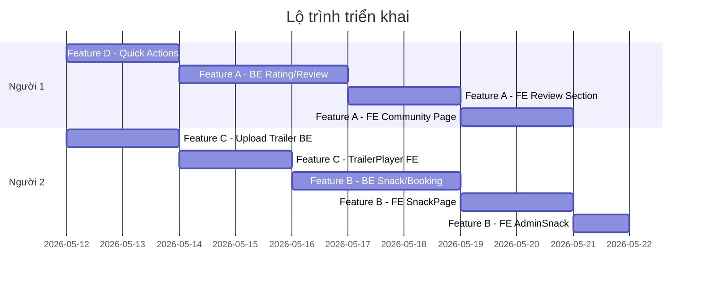

## Tổng quan

Nâng cấp hệ thống rạp chiếu phim Sanemi với 4 tính năng lớn:
- **Feature A**: Rating + Bình luận cộng đồng
- **Feature B**: Bắp nước / Combo trong luồng đặt vé
- **Feature C**: Trailer nhúng trực tiếp + Trang quản lý Trailer
- **Feature D**: Nút "Xem Trailer" / "Chi tiết" trên HomePage & MoviesPage

### Quyết định đã xác nhận
- ✅ **Host video trailer**: Do Người 2 (Feature C) tự quyết định khi bắt tay làm (Cloudinary / Bunny.net / self-host).
- ✅ **Phụ đề / Lồng tiếng**: Lùi sang **Phase 2**, không nằm trong scope hiện tại.
- ✅ **Thứ tự thực hiện**: Giữ nguyên theo Gantt — D → A (P1) song song C → B (P2).

---

## Phân công

| | **Người 1** | **Người 2** |
|---|---|---|
| **Feature chính** | Feature A — Rating & Bình luận | Feature B — Bắp/Nước/Combo |
| **Feature phụ** | Feature D — Quick Actions (Trailer/Detail buttons) | Feature C — Trailer Player & Quản lý |
| **Nhánh Git** | `feature/rating-comment` | `feature/snack-combo` |

> **Lý do phân chia**: Feature A + D có liên quan đến nhau (xem phim → muốn xem trailer nhanh → đọc bình luận). Feature B + C có liên quan ở luồng đặt vé và quản lý nội dung phim.

---

## Feature A — Rating & Bình luận *(Người 1)*

### Mô tả
- User đã có **booking paid** mới được **rating** (1–5 sao), có thể sửa lại.
- **Mọi user đã đăng nhập** đều có thể **bình luận**.
- Có **trang Cộng đồng** (`/community`) hiển thị toàn bộ bình luận, lọc được theo phim.
- Admin có thể **xóa bình luận** không phù hợp.

### Backend

#### [NEW] Entity: `Reviews.java`
```
- id (PK)
- user (FK → Users)
- movie (FK → Movies)
- rating: Integer (1–5, nullable — user chưa rate thì null)
- content: String TEXT (nullable — chỉ rate không có nội dung cũng được)
- createdAt: LocalDateTime
- updatedAt: LocalDateTime
```
> Constraint: `UNIQUE(user_id, movie_id)` — mỗi user chỉ có 1 review/phim, muốn sửa thì UPDATE.

#### [NEW] `ReviewController.java`
```
POST   /api/reviews              — Tạo hoặc cập nhật review (upsert)
GET    /api/reviews/movie/{id}   — Lấy tất cả review của 1 phim (public)
GET    /api/reviews/community    — Tất cả review, hỗ trợ ?movieId=&page=&size=
GET    /api/reviews/my/{movieId} — Xem review của chính mình cho phim đó
DELETE /api/reviews/{id}         — Admin xóa review
```

#### [NEW] `ReviewService.java`
- Kiểm tra user có booking `paid` cho phim đó không → mới cho rating.
- Bình luận không cần điều kiện booking.
- Upsert: nếu đã có review → UPDATE, chưa có → INSERT.
- Tính `averageRating` theo phim (aggregate query hoặc tính real-time).

#### [MODIFY] `Movies.java`
- Thêm field `averageRating: Double` (cập nhật sau mỗi review) hoặc tính động từ DB.

### Frontend

#### [NEW] `ReviewSection.jsx` (component, dùng trong MovieDetail)
- Hiển thị điểm sao trung bình + số lượng đánh giá.
- Form rating 5 sao (dạng click vào sao, highlight).
- Textarea nhập bình luận.
- Danh sách bình luận: avatar/tên user, ngày, nội dung, sao.
- Nút xóa (chỉ hiện với Admin).

#### [NEW] `CommunityPage.jsx` — route `/community`
- Header + mô tả trang.
- **Filter bar**: Tìm theo tên phim (dropdown hoặc search).
- **Sort**: Mới nhất / Cao điểm nhất / Thấp nhất.
- Danh sách card bình luận: thumbnail phim, tên phim, nội dung, sao, tên user, ngày.
- Phân trang (pagination).

#### [NEW] `reviewService.js` — trong `/services`
```js
createOrUpdateReview(data)
getReviewsByMovie(movieId)
getCommunityReviews(params)
getMyReview(movieId)
deleteReview(id)
```

#### [MODIFY] `MovieDetail.jsx`
- Thêm `<ReviewSection movieId={id} />` ở cuối trang.

#### [MODIFY] `Header.jsx` / navigation
- Thêm link **"Cộng đồng"** vào menu điều hướng.

#### [MODIFY] `AdminDashboard.jsx`
- Thêm menu điều hướng đến trang quản lý review (nếu cần trang riêng).

---

## Feature B — Bắp/Nước/Combo *(Người 2)*

### Mô tả
- Luồng mới: **Chọn ghế → Chọn Bắp/Nước → Thanh toán tổng**.
- Admin có thể **thêm/sửa/xóa** item trong menu bắp nước.
- Giá combo/bắp/nước cộng vào `totalPrice` trước khi tạo link VNPay.
- Sẵn có mặc định: Bắp lớn, Bắp nhỏ, Pepsi, Cola, Combo 1 (bắp + nước).

### Backend

#### [NEW] Entity: `SnackItems.java`
```
- id (PK)
- name: String         (VD: "Bắp lớn", "Pepsi 600ml")
- price: Double
- category: Enum       (POPCORN / DRINK / COMBO)
- imageUrl: String     (ảnh minh họa)
- available: Boolean   (admin có thể ẩn)
```

#### [NEW] Entity: `BookingSnacks.java`
```
- id (PK)
- booking (FK → Bookings)
- snackItem (FK → SnackItems)
- quantity: Integer
- unitPrice: Double    (lưu giá tại thời điểm đặt, tránh thay đổi sau)
```

#### [MODIFY] `Bookings.java`
- Thêm `@OneToMany` → `BookingSnacks`.

#### [NEW] `SnackController.java`
```
GET    /api/snacks              — Lấy menu (public, chỉ item available=true)
POST   /api/admin/snacks        — Admin thêm item
PUT    /api/admin/snacks/{id}   — Admin sửa item
DELETE /api/admin/snacks/{id}   — Admin xóa/ẩn item
```

#### [MODIFY] `BookingController.java` / `BookingService.java`
- API tạo booking nhận thêm `snackItems: List<{snackItemId, quantity}>`.
- `totalPrice = (ghế × giá) + (snack × giá)`.
- Lưu `BookingSnacks` cùng lúc khi tạo booking.

#### [NEW] `SnackService.java`
- CRUD cho SnackItems.
- Validate quantity > 0, item available.

### Frontend

#### [NEW] `SnackPage.jsx` — route `/booking/snacks/:bookingId`
- Layout 2 cột:
  - **Trái**: Danh sách item chia theo tab: Bắp / Nước / Combo.
  - **Phải**: Giỏ hàng nhỏ — item đã chọn, số lượng (+/-), tổng tiền ghế + snack.
- Nút **"Bỏ qua"** (không chọn snack) → nhảy thẳng đến thanh toán.
- Nút **"Tiếp tục"** → chuyển sang `PaymentPage`.

#### [MODIFY] `BookingPage.jsx` (trang chọn ghế)
- Sau khi confirm ghế → navigate đến `/booking/snacks/:bookingId` thay vì thẳng đến payment.

#### [MODIFY] `PaymentPage.jsx`
- Hiển thị thêm phần **"Bắp/Nước đã chọn"** trong bảng tóm tắt đơn hàng.
- `totalPrice` đã bao gồm snack từ backend.

#### [NEW] `ManageSnacks.jsx` — trong AdminDashboard
- Bảng danh sách item, có toggle show/hide.
- Form thêm/sửa: tên, giá, category, ảnh, trạng thái.

#### [NEW] `snackService.js` — trong `/services`
```js
getSnackMenu()
addSnack(data)
updateSnack(id, data)
deleteSnack(id)
```

---

## Feature C — Trailer Player & Quản lý *(Người 2)*

### Mô tả
- Trailer được upload lên server nguồn (Cloudinary free / Bunny.net free tier).
- Xem trailer nhúng trực tiếp trên trang web (không chuyển hướng).
- Admin có trang riêng để upload trailer, thêm phụ đề, lồng tiếng.

### Backend

#### [MODIFY] `Movies.java`
- `trailerUrl` hiện tại → giữ nguyên, đổi nghĩa sang URL file video hosted.
- Thêm `List<TrailerSubtitles>` (nếu làm phụ đề).

#### [MODIFY] `UploadController.java`
- Thêm endpoint `POST /api/admin/movies/{id}/trailer` — nhận file video, upload lên nền tảng do Người 2 chọn (Cloudinary / Bunny.net / self-host), lưu URL vào `movies.trailer_url`.

> [!NOTE]
> **Phụ đề / Lồng tiếng** đã được lùi sang Phase 2. Entity `TrailerSubtitles` và endpoint upload phụ đề sẽ không thực hiện trong đợt này.

### Frontend

#### [NEW] `TrailerPlayer.jsx` (component)
- Dùng thẻ `<video>` HTML5 hoặc thư viện `react-player`.
- Controls: play/pause, volume, fullscreen.
- Lazy load — chỉ load video khi user click.
- *(Phụ đề: Phase 2)*

#### [NEW] `ManageTrailer.jsx` — trong AdminDashboard
- Chọn phim từ dropdown.
- Upload file video (hiển thị progress bar).
- Upload file phụ đề (.srt/.vtt) kèm chọn ngôn ngữ.
- Preview trailer hiện tại đang được set.

#### [MODIFY] `MovieDetail.jsx`
- Thay thế link YouTube cũ bằng `<TrailerPlayer trailerUrl={movie.trailerUrl} subtitles={movie.subtitles} />`.

---

## Feature D — Quick Action Buttons *(Người 1)*

### Mô tả
- Trên **HomePage** và **MoviesPage**, mỗi card phim có 2 nút:
  - **"▶ Xem Trailer"** → mở modal xem trailer inline (không rời trang).
  - **"Chi tiết"** → navigate đến `/movie/:id`.
- Nếu phim chưa có trailer → nút trailer disabled + tooltip "Chưa có trailer".

### Frontend only (không cần thêm BE)

#### [NEW] `TrailerModal.jsx` (component)
- Modal overlay toàn màn hình.
- Chứa `<TrailerPlayer />` (dùng lại từ Feature C).
- Nút đóng (ESC hoặc click nền).
- Animation mở/đóng mượt.

#### [MODIFY] `HomePage.jsx` — hàm `renderMovieCard`
- Thêm 2 nút vào card: **"▶ Trailer"** và **"Chi tiết"**.
- State `trailerModalMovie` để kiểm soát modal đang mở phim nào.

#### [MODIFY] `MoviesPage.jsx` — card phim
- Tương tự HomePage, thêm 2 nút hành động nhanh.
- Reuse `TrailerModal` component.

---

## Thứ tự thực hiện được đề xuất



---

## Cấu trúc file mới cần tạo

### Backend
```
Entity/
  Reviews.java          [NEW - P1]
  SnackItems.java       [NEW - P2]
  BookingSnacks.java    [NEW - P2]
  (TrailerSubtitles.java — Phase 2, chưa làm)

Controller/
  ReviewController.java  [NEW - P1]
  SnackController.java   [NEW - P2]

Service/
  ReviewService.java     [NEW - P1]
  SnackService.java      [NEW - P2]

Repository/
  ReviewRepository.java  [NEW - P1]
  SnackItemRepository.java  [NEW - P2]
  BookingSnackRepository.java [NEW - P2]

dto/request/
  ReviewRequest.java     [NEW - P1]
  SnackRequest.java      [NEW - P2]

dto/response/
  ReviewResponse.java    [NEW - P1]
  SnackItemResponse.java [NEW - P2]
```

### Frontend
```
components/pages/
  CommunityPage.jsx      [NEW - P1]
  SnackPage.jsx          [NEW - P2]
  ManageSnacks.jsx       [NEW - P2]
  ManageTrailer.jsx      [NEW - P2]

components/common/
  ReviewSection.jsx      [NEW - P1]
  TrailerPlayer.jsx      [NEW - P2]
  TrailerModal.jsx       [NEW - P1]

services/
  reviewService.js       [NEW - P1]
  snackService.js        [NEW - P2]
```

---

## Lưu ý kỹ thuật

> [!NOTE]
> **Host video trailer**: Do **Người 2 tự quyết định** khi bắt đầu Feature C. Gợi ý: Cloudinary (free 25GB, SDK đầy đủ) hoặc Bunny.net (10GB free, CDN nhanh hơn). Quyết định xong cần thông báo lại để Người 1 biết khi tích hợp `TrailerPlayer`.

> [!IMPORTANT]
> **Upsert Review**: Cần `UNIQUE constraint (user_id, movie_id)` ở DB, dùng `@Upsert` hoặc `findByUserAndMovie` → save để tránh duplicate.

> [!WARNING]
> **Luồng Snack + Booking**: Khi user chọn ghế → backend tạo booking `pending` → user chọn snack → update snack vào booking → thanh toán. Cần đảm bảo booking không bị expire trước khi user chọn xong snack.

> [!TIP]
> **TrailerModal + TrailerPlayer**: Người 2 nên hoàn thành `TrailerPlayer.jsx` trước để Người 1 có thể import vào `TrailerModal.jsx` mà không cần chờ.

---

## Git workflow

```
dev (nhánh chính phát triển)
├── feature/rating-comment     ← Người 1
└── feature/snack-combo        ← Người 2
```

Mỗi feature hoàn thiện → PR vào `dev` → review chéo → merge.
